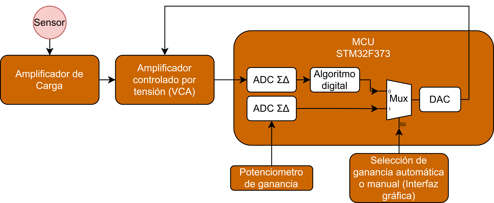

# VDA_Firmware

This repository contains the firmware source code for the **VDA Signal Acquisition System**, developed on an STM32 microcontroller platform. The firmware handles analog signal acquisition, real-time digital filtering, gain control, and communication with a PC-based graphical interface.

## ⚙️ System Overview

The firmware performs the following core tasks:

- Analog signal acquisition via a 16-bit ADC
- Digital filtering (Notch IIR filter centered at 50 Hz)
- Optional AGC (Automatic Gain Control) using a PID algorithm
- UART communication with a Python-based GUI
- Command-driven control logic for runtime operation

## 📷 Functional Block Diagram

## ⏱️ Signal Processing Details

- **Sampling rate**: 180 Hz (fixed)
- **Analog front-end bandwidth**: 0.16 Hz to 34 Hz
- **Digital filter**: 2nd-order Butterworth IIR Notch filter centered at 50 Hz
- **AGC**: PID-based gain control that adjusts a voltage-controlled amplifier (VCA)

## 🔌 Communication Protocol

The firmware listens for ASCII commands via UART. Supported commands include:

| Command       | Description                                  |
|---------------|----------------------------------------------|
| `ASTARTZ`     | Start real-time acquisition                  |
| `ASTOPZ`      | Stop real-time acquisition                   |
| `AACQZ`       | Start logging to file (on PC side)           |
| `AAGCONZ`     | Enable Automatic Gain Control (AGC)          |
| `AAGCOFFZ`    | Disable AGC                                  |
| `ARESETZ`     | Reset system and clear buffers               |

Commands are sent from the PC via a custom GUI developed in Python.

## 🧪 Development Environment

- **IDE**: STM32CubeIDE
- **MCU**: STM32F373CBT6 (or compatible STM32 series)
  
## 📬 Contact

For questions, bug reports or collaboration proposals, please open an issue or contact me.

[leandrozabala@mdp.edu.ar](leandrozabala@mdp.edu.ar)
